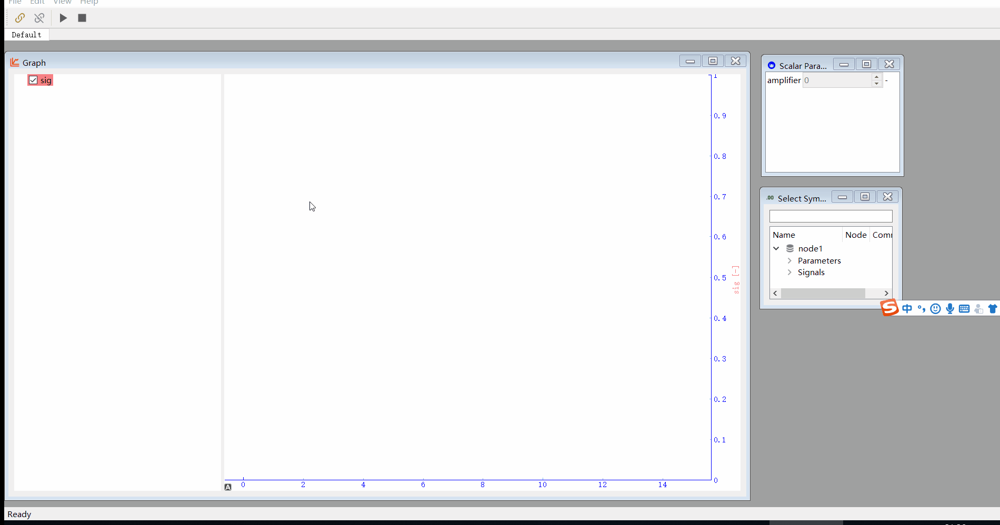

# DaDuPo
XCP client for real time calibration and measurement.

DaDuPo is a small mountain in my hometown, it looks like a big fat belly lying on the way to my grandmother's house. Just missing the old time.

# Show

# Notes
it's now still under development, but core functionalities is ready to use.

## files:
- demo.mcs stores the ui information and also measurement configuration. it's saved when the app is closed and loaded at startup automatically.
- project.json defines the communication interface.
- node1.json describes the data stores in RAM/FLASH, datatype, size, conversion, unit and so on.
- example/XcpMaster is a arduino project tested on a esp32 dev board. see https://github.com/feversky/Arduino-Xcp

# Basic Concepts
there are lots of information of ASAM XCP, just google it.

there are two types of uploading a data:
1. polling.  client send the address and size to master and the master send back the raw data read from it's memory on every read action.
2. daq. client writes the address, size, event channel of targets to master when the measurement is started, later the master uploads the data every time the event is activated.

generally it's recommended to use daq for measurement to save the bus load.
